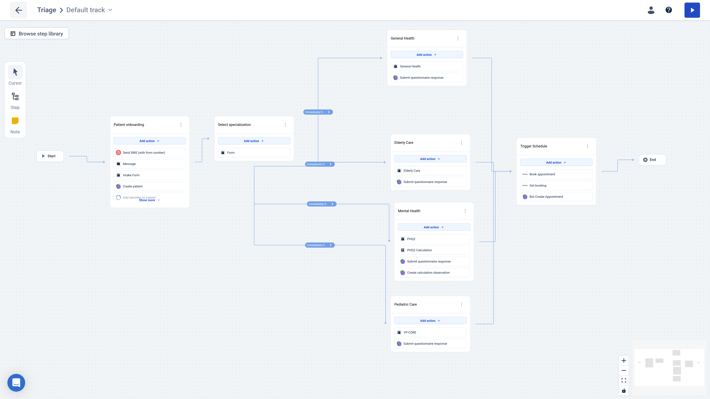

# medplum-awell-intake

A comprehensive patient intake and management system built with React, utilizing Medplum for healthcare data management. This application provides an interface for managing patients, practitioners, and healthcare resources.

## Demo

[](http://www.youtube.com/watch?v=2TKH6SzY8cw "Awell and Medplum integration demo: building automated healthcare workflows")

## Features

- Patient Management
  - View and manage patient list
  - Detailed patient profiles with medical history
  - Create new patient records
  - Track patient timeline and overview
- Practitioner Management
  - Browse practitioner directory
  - View detailed practitioner information and availability
- Resource Timeline
  - Chronological view of patient-related events and resources
  - Interactive timeline for tracking patient journey
- Automated Workflows
  - Triage automation via bots
  - Resource management automation

## Care Flow Process

We are using awell as our care ops orchestration tool.

- Patient onboarding through initial intake forms
- Specialization selection based on patient needs
- Questionnaire and assessment completion
- Care pathway activation based on specialization
- Care schedule management



\*To check details of the awell workflow check the `awell-triage-test` branch.

## Technology Stack

- React with TypeScript
- Vite for build tooling
- Medplum SDK for healthcare data integration
- Awell as a care ops tool

### Getting Started

Install the dependencies

```bash
npm install
```

Then, run the app

```bash
npm run dev
```

This app should run on `http://localhost:3000/`

## Project Structure

- `/src` - Main source code directory
- `/bots` - Automation bots for triage and resource management
- `/components` - Reusable UI components for patient and practitioner management
- `/pages` - Application pages using React components
- `/utils` - Utility functions and helper methods

## License

This project is licensed under the MIT License - see the `LICENSE.txt` file for details.

## Commercial Support

[](https://www.vintasoftware.com/)

This is an open-source project maintained by [Vinta Software](https://www.vinta.com.br/). We are always looking for exciting work! If you need any commercial support, feel free to get in touch: contact@vinta.com.br
